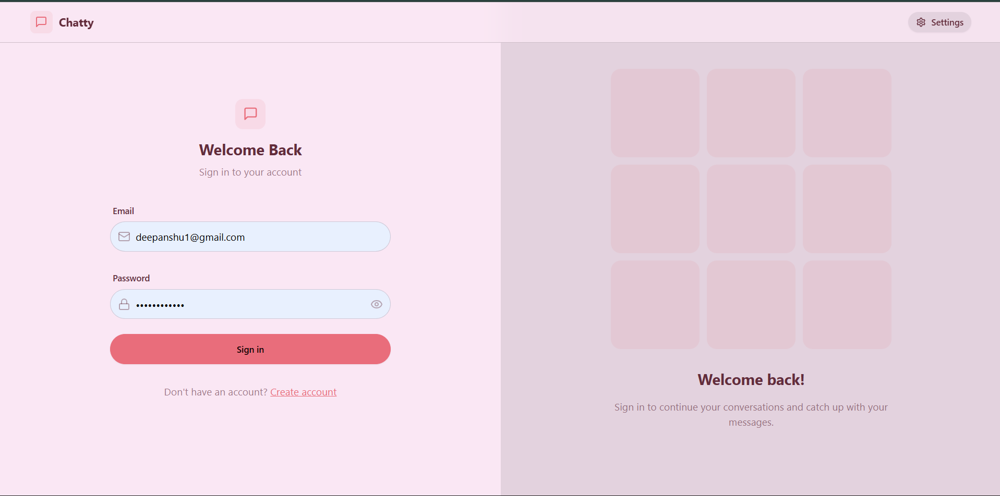
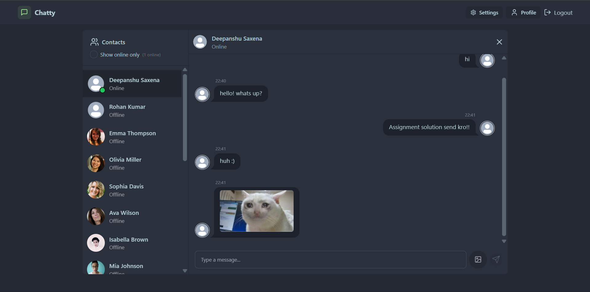
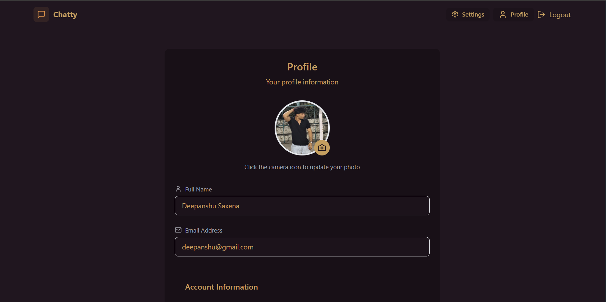
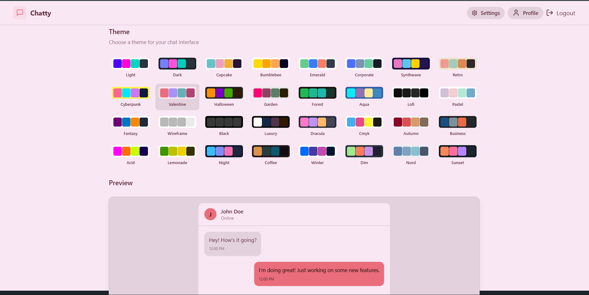

# Echo - Real-Time Chat Application

**🔗 Live Demo:** [https://echo-5la9.onrender.com/](https://echo-5la9.onrender.com/)

A modern, full-stack real-time chat application with user authentication, instant messaging, and theme customization.

## 📸 Demo Screenshots

### Login Interface


### Chat Interface


### User Profile


### Theme Customization

.png)


## 🛠️ Tech Stack

### Backend
- **Node.js** - JavaScript runtime
- **Express.js** - Web framework
- **MongoDB** - NoSQL database (via Mongoose ODM)
- **Socket.io** - Real-time bidirectional communication
- **JWT (jsonwebtoken)** - Authentication tokens
- **bcryptjs** - Password hashing
- **Cloudinary** - Image/media hosting
- **CORS** - Cross-origin resource sharing
- **Cookie Parser** - HTTP cookie parsing
- **Dotenv** - Environment variables
- **Nodemon** - Development auto-restart

### Frontend
- **React 18** - UI library
- **Vite** - Build tool and dev server
- **Tailwind CSS** - Utility-first CSS framework
- **DaisyUI** - Component library for Tailwind
- **Socket.io-client** - Real-time client communication
- **Zustand** - lightweight state management
- **React Router DOM** - Client-side routing
- **Axios** - HTTP client
- **React Hot Toast** - Notifications
- **Lucide React** - Icon library
- **ESLint** - Code quality

## ✨ Features

- ✅ User Authentication (Sign up, Login, Logout)
- ✅ Real-time messaging using Socket.io
- ✅ User profiles with avatar customization
- ✅ Theme switching (Light/Dark modes)
- ✅ Online status indicators
- ✅ Responsive design
- ✅ Secure password hashing
- ✅ JWT-based authentication
- ✅ Cloud-based image storage with Cloudinary

## 🚀 Getting Started

### Prerequisites
- Node.js (v14 or higher)
- npm or yarn
- MongoDB
- Cloudinary account

### Installation & Setup

1. **Clone the repository**
   ```bash
   git clone <repository-url>
   cd Echo
   ```

2. **Install dependencies**
   ```bash
   npm run build
   ```

3. **Backend Setup**
   ```bash
   cd backend
   ```
   Create a `.env` file in the backend folder:
   ```env
   PORT=5000
   MONGODB_URI=your_mongodb_connection_string
   JWT_SECRET=your_jwt_secret
   CLOUDINARY_CLOUD_NAME=your_cloudinary_name
   CLOUDINARY_API_KEY=your_cloudinary_key
   CLOUDINARY_API_SECRET=your_cloudinary_secret
   ```

4. **Frontend Setup**
   - Create a `.env` file in the frontend folder if needed for API endpoints

5. **Run the application**
   - Backend: `npm run dev` (from backend directory)
   - Frontend: `npm run dev` (from frontend directory)
   - Production: `npm start` (from root directory)

## 📁 Project Structure

```
Echo/
├── backend/
│   ├── src/
│   │   ├── index.js
│   │   ├── controllers/
│   │   ├── routes/
│   │   ├── middleware/
│   │   ├── models/
│   │   ├── lib/
│   │   └── seeds/
│   └── package.json
├── frontend/
│   ├── src/
│   │   ├── components/
│   │   ├── pages/
│   │   ├── store/
│   │   ├── lib/
│   │   └── constants/
│   ├── public/
│   └── package.json
└── README.md
```

## 📝 Available Scripts

### Root Level
- `npm run build` - Install dependencies and build the frontend
- `npm start` - Start the backend server

### Backend
- `npm run dev` - Start with nodemon (auto-restart on changes)
- `npm start` - Start the server

### Frontend
- `npm run dev` - Start Vite dev server
- `npm run build` - Build for production
- `npm run preview` - Preview production build
- `npm run lint` - Run ESLint

## 🔐 Authentication

The application uses JWT tokens stored in HTTP-only cookies for secure authentication. Passwords are hashed using bcryptjs before storage.

## 🔌 Real-Time Features

Socket.io enables:
- Live message delivery
- Online/offline status
- Real-time notifications
- Instant updates across connected clients

## 📱 Responsive Design

Built with Tailwind CSS and DaisyUI, the application is fully responsive on:
- Desktop
- Tablet
- Mobile devices

## 🌐 Environment Variables

Create `.env` files in both backend and frontend directories as needed:

**Backend (.env)**
```
PORT=5000
MONGODB_URI=mongodb://...
JWT_SECRET=your_secret
CLOUDINARY_CLOUD_NAME=...
CLOUDINARY_API_KEY=...
CLOUDINARY_API_SECRET=...
```

## 📄 License

ISC

## 👨‍💻 Author

Your Name

---

**Happy Chatting! 💬**
